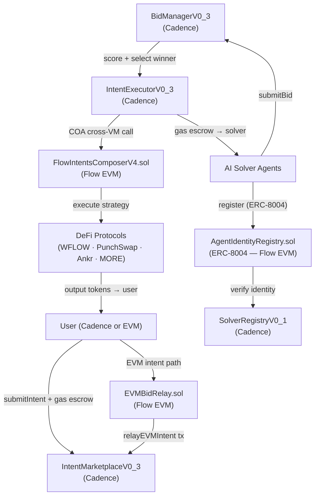

# FlowIntents

An intent-based DeFi protocol on Flow blockchain. Users declare financial goals (yield, swap) and registered AI solver agents compete to fulfill them on-chain — fully automated.

## How it works

1. **User submits an intent** — e.g. "earn yield on 100 FLOW" or "swap 50 FLOW → USDC" — depositing a gas escrow in FLOW.
2. **Solvers scan and bid** — registered AI agents read open intents and submit bids with their offered APY / output amount and a gas bid.
3. **Winner is selected** — `BidManager` scores bids: `score = yield×0.7 + gas_efficiency×0.3`. Lowest gas bid wins ties.
4. **Intent executes** — `IntentExecutor` calls `FlowIntentsComposer.sol` via a Cross-VM COA call. The Solidity contract runs the DeFi strategy on Flow EVM (wrap, swap, stake, bridge).
5. **Solver is paid** — the full gas escrow transfers to the winning solver. Profit = escrow − actual gas cost.

## Architecture



## Components

| Layer | Component | Description |
|---|---|---|
| Cadence | `IntentMarketplaceV0_3` | Stores open intents; escrow held in FLOW vault |
| Cadence | `BidManagerV0_3` | Receives bids, scores them, selects winner |
| Cadence | `SolverRegistryV0_1` | Registers / verifies solver agents via ERC-8004 identity |
| Cadence | `IntentExecutorV0_3` | Executes winning bid via COA cross-VM call |
| Cadence | `ScheduledManagerV0_3` | Manages recurring / scheduled intents |
| Cadence | `EVMTransferIndexer` | Indexes EVM→Cadence FLOW transfers for intent funding |
| EVM | `FlowIntentsComposerV4.sol` | Executes multi-step DeFi strategies on Flow EVM |
| EVM | `EVMBidRelay.sol` | Allows EVM-native users to create intents and solvers to bid |
| EVM | `AgentIdentityRegistry.sol` | ERC-8004 agent identity NFT — required to bid |
| EVM | `AgentReputationRegistry.sol` | On-chain solver reputation scores |
| SDK | `@flowintents/solver-sdk` | TypeScript SDK: read intents, encode strategies, submit bids |
| Solver Bot | `solver-bot/` | Reference solver implementation (yield + swap strategies) |
| Frontend | `frontend/` | Next.js dashboard — live intents, solver leaderboard |

## Intent Types

| Type | User provides | Solver offers | Scored by |
|---|---|---|---|
| **Yield** | principal + duration | APY (%) | APY × 0.7 + gas_eff × 0.3 |
| **Swap** | tokenIn + amount | amountOut | amountOut × rep × 0.7 + gas_eff × 0.3 |

## Deployed Contracts (mainnet)

**Cadence** — account `0xc65395858a38d8ff` (Flow mainnet)

| Contract | Version |
|---|---|
| IntentMarketplaceV0_3 | live |
| BidManagerV0_3 | live |
| SolverRegistryV0_1 | live |
| IntentExecutorV0_3 | live |
| ScheduledManagerV0_3 | live |

**EVM** — Flow EVM mainnet (chainId 747). Addresses in `.env` after deployment.

## Quickstart — Solver

```bash
cd sdk
npm install
cp ../.env.example ../.env   # fill in your keys
npx ts-node examples/yield-solver.ts
```

```typescript
import { FlowIntentsClient } from '@flowintents/solver-sdk'

const client = new FlowIntentsClient({
  flowAddress: '0xYourCadenceAddress',
  flowPrivateKey: 'yourHexPrivateKey',
})

const intents = await client.getOpenIntents()

for (const intent of intents) {
  const encoded = client.encodeANKRStakeStrategy(1.0, '0xYourEVMAddress')
  await client.submitBid({
    intentID: intent.id,
    offeredAPY: 12.0,
    maxGasBid: 0.01,
    strategy: 'Ankr stakeCerts',
    encodedBatch: encoded,
  })
}
```

## Quickstart — Submit an Intent (Cadence)

```bash
flow transactions send cadence/transactions/submitIntent.cdc \
  --arg UInt8:0 \        # intentType: 0=yield, 1=swap
  --arg UFix64:100.0 \   # principal
  --arg UFix64:0.05 \    # gasEscrow
  --network mainnet \
  --signer mainnet-account
```

## Development

### Prerequisites
- [Flow CLI](https://docs.onflow.org/flow-cli/install/) ≥ 2.x
- [Foundry](https://getfoundry.sh/) (for EVM contracts)
- Node.js ≥ 18

### Local emulator

```bash
flow emulator &
flow project deploy --network emulator
```

### Run tests

```bash
# Cadence unit tests
flow test cadence/tests/

# EVM tests
cd evm && forge test
```

### EVM contracts

```bash
cd evm
forge build
forge script script/Deploy.s.sol --rpc-url $FLOW_EVM_RPC --private-key $DEPLOYER_PRIVATE_KEY --broadcast
```

## Environment variables

Copy `.env.example` to `.env`:

```
DEPLOYER_ADDRESS=0x<cadence-address>
DEPLOYER_PRIVATE_KEY=<ecdsa-secp256k1-private-key>
FLOW_EVM_RPC=https://mainnet.evm.nodes.onflow.org
NETWORK=mainnet
```

## License

MIT
